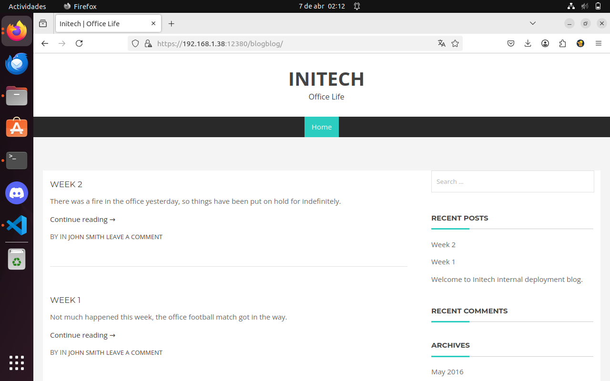
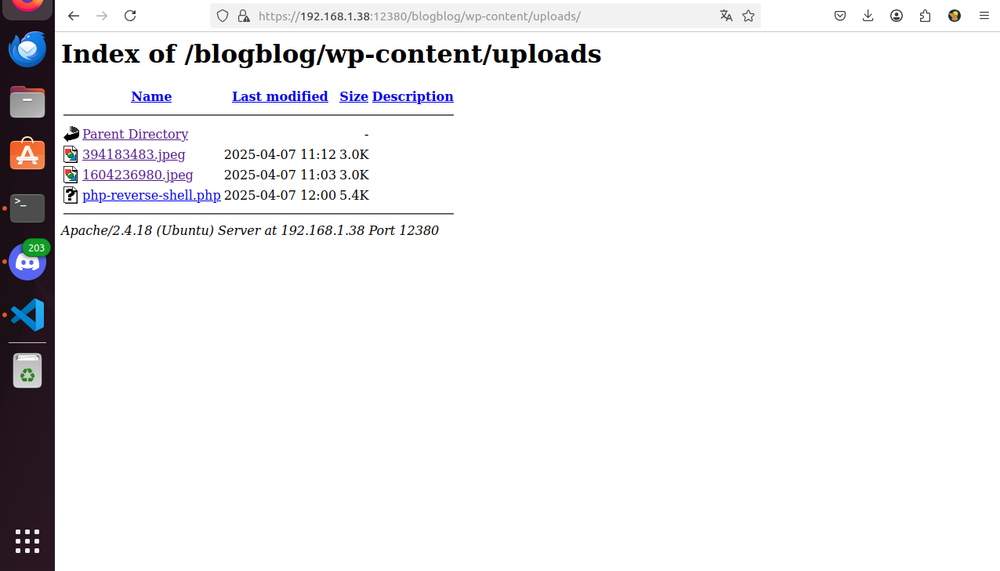

# Práctica de Pentesting: Máquina Virtual *Stapler*

## Entorno

- **Máquina objetivo:** Stapler  
- **Red utilizada:** Red local (192.168.1.0/24)  
- **Herramientas utilizadas:** `netdiscover`, `nmap`, `ftp` , `nikto`, `enum4linux`, `smbclient`. `netcat`, `display`, `tee`, `dirb`, `wpscan`, `python2`, `mysql`
- **Sistema atacante:** Kali Linux (u otra distribución enfocada a pentesting)

---

## Paso 1: Descubrimiento de la máquina en la red

### Comando utilizado

```bash
sudo netdiscover -r 192.168.1.0/24
```

### Explicación

Se utilizó `netdiscover` para identificar dispositivos activos en la red local mediante peticiones ARP. La opción `-r` permite definir el rango de direcciones IP a escanear.

```
192.168.1.0/24: Escanea todo el rango de IPs desde 192.168.1.1 hasta 192.168.1.254.
```

Esta herramienta es muy útil en redes donde no se tiene acceso al router o a una lista previa de hosts.

### Resultado

Se identificó que la máquina *Stapler* tiene la siguiente IP:

```
192.168.1.38
```


---

## Paso 2: Escaneo de servicios y sistema operativo

### Comando utilizado

```bash
sudo nmap -A -T4 -sV 192.168.1.38
```

### Explicación

Se utilizó `nmap` para realizar un escaneo completo a la máquina víctima. A continuación se detalla el propósito de cada opción:

- `-A`: Activar detección de sistema operativo, versión de servicios, scripts NSE comunes y traceroute.
- `-T4`: Aumenta la velocidad del escaneo sin comprometer demasiado la precisión (ideal para redes locales).
- `-sV`: Identifica versiones exactas de los servicios descubiertos.

Este escaneo permite descubrir qué puertos están abiertos, qué servicios corren en ellos y qué versiones exactas están en uso, lo cual es clave para identificar vulnerabilidades potenciales.

### Resultado

```
PORT     STATE  SERVICE     VERSION
20/tcp   closed ftp-data
21/tcp   open   ftp         vsftpd 2.0.8 or later
22/tcp   open   ssh         OpenSSH 7.2p2 Ubuntu 4 (Ubuntu Linux; protocol 2.0)
53/tcp   open   domain      dnsmasq 2.75
80/tcp   open   http        PHP cli server 5.5 or later
139/tcp  open   netbios-ssn Samba smbd 3.X - 4.X (workgroup: WORKGROUP)
666/tcp  open   doom?       (servicio desconocido)
3306/tcp open   mysql       MySQL 5.7.12-0ubuntu1
```

### Servicios destacados encontrados

- **FTP (puerto 21):** vsftpd 2.0.8 o superior. Permite login anónimo, aunque falla al listar el contenido con `PASV`.
- **SSH (puerto 22):** OpenSSH 7.2p2.
- **DNS (puerto 53):** dnsmasq 2.75.
- **HTTP (puerto 80):** PHP CLI Server. Responde con página 404.
- **Samba (puerto 139):** Workgroup WORKGROUP activo.
- **Puerto 666:** Detectado como "doom?", con respuesta no reconocida. Puede indicar un servicio personalizado o malicioso.
- **MySQL (puerto 3306):** Versión 5.7.12.

### Detección del sistema operativo

- **Sistema operativo:** Linux (kernel entre 3.2 y 4.9)
- **Nombre NetBIOS:** RED
- **Distancia de red:** 1 salto

### Scripts NSE relevantes

- **ftp-anon:** Permite login anónimo.
- **smb-security-mode / smb2-security-mode:** La firma de mensajes SMB no es obligatoria (potencial vulnerabilidad).

---

## Paso 3: Acceso al servicio FTP

### Comando utilizado

```bash
ftp 192.168.1.38 21
```


### Explicación

Dado que el escaneo `nmap` reveló que el servicio FTP está habilitado y permite login anónimo, se intentó acceder a través del cliente de línea de comandos `ftp`.

Se conectó exitosamente al servidor utilizando el usuario `anonymous`, lo que confirma que el servicio tiene acceso abierto sin autenticación fuerte. Esta configuración es considerada una mala práctica de seguridad, ya que permite que cualquier persona acceda (limitadamente) al sistema de archivos.

### Resultado

El acceso anónimo fue exitoso, aunque el intento de listar directorios con ls falló debido a un error PASV (modo pasivo). Esto puede deberse a restricciones en la configuración del servidor FTP o del firewall.

Sin embargo, al realizar la misma prueba desde la máquina host (en lugar de la máquina atacante), se logró listar el directorio sin problemas, lo que indicó que el problema estaba relacionado con el firewall en la máquina atacante.

## Paso 4: Transferencia de archivos

### Comando utilizado

```bash
mget note
```
### Explicacion

Se descubrió que había un archivo llamado note en el directorio FTP accesible. Usando el comando mget note, se solicitó la transferencia del archivo desde el servidor FTP a la máquina atacante.

Este comando solicita la transferencia de un archivo desde el servidor FTP al sistema local. El sistema pidió confirmación para cada archivo, y se respondió con yes para continuar con la transferencia.

### Resultado 

El archivo note fue transferido a mi maquina y al leerlo decía esto:

- "Ellie make sure you update the payload information. leave it on your FTP account. John"

### Análisis

Ya hemos podido sacar 3 nombres de posibles usuarios, Ellie, John y Harry

# Paso 5: Probamos a ver que tiene en el puerto 80

Nos metemos en el buscador de Firefox y ponemos la IP de la maquina, esto es lo que vemos, como se puede observar no nos devuelve nada de interes


# Paso 6: Lanzamos nikto

Vamos a pasarle nikto para realizar un escaneo del sitio web detectando la version del servidor, vulnerabilidades, etc...

## Comando utilizado

```bash
nikto -h 192.168.1.38
```


### Resultado

Esto es la información que nos devuelve, no es de mucha ayuda asi que vamos a probar a lanzar el nikto a un puerto sospechoso en este caso el 12380


## Comando utilizado

```bash
nikto -h 192.168.1.38:12380
```

### Resultado

Como se puede ver nos saca dos directorios, el que nos interesa es /blogblog/

# Paso 7 Enum4linux

Como hemos detectado un samba con el nmap y el nikto tarda bastante rato en terminar voy a lanzar enum4linux a ver que información podemos sacacr de aqui, lo guardamos en un archivo llamado "enum4lin.txt".

## Comando utilizado

```bash
enum4linux -a 192.168.1.38 | tee enum4lin.txt
```

### Analisis

- En la parte de "Share Enumeration" hay una carpeta interesante que se llama kathy
- Sacamos un monton de usuarios:


# Paso 8 Investigamos el smb

Gracias al comentario referido a la carpeta de Kathy intentamos entrar con smbclient usando el usuario de Fred sin contraseña para entra al sistema y efectivamente podemos.

## Comando utilizado

```bash
smbclient -I 192.168.1.38 -N //fred/kathy
```
```bash
smbclient -I 192.168.1.38 -N //fred/tmp
```


## Resultados

- Dentro de kathy hay dos carpetas /kathy_stuff en la cual hay un archivo "todo-list.txt", y otra llamada /backup que contiene "vsftpd.conf" y "wordpress-4.tar.gz".

- Tambien entro en /tmp y solo hay un archivo que se llama "ls" que tiene contenido listado de la carpeta de root.

- El "vsftpd.conf" es una copia de la configuración del servidor de FTP y "wordpress-4.tar.gz" es una copia de una página de Wordpress sin configurar. (Que más tarde entenderemos). En la todo-list no hay nada interesante.

# Paso 9 Puerto 666

Usando la información del nmap decido tirarle un netcat al puerto 666

## Comando utilizado

```bash
netcat 192.168.1.38 666
```
```bash
wget 192.168.1.38:666
```

## Resultados

Nada más ver el resultado del netcat me podía imaginar que lo que habia detrás era una imagen asi que le lanzo un wget, al abrirla hay una foto ilegal.

# Paso 10 Volvemos a la parte web

He descubierto una herramienta bastante buena que se llama dirb, la uso para determinar los directorios del sitio web del puerto 80 con la lista commons.txt, descubro que la página esta conectada con un directorio home del sistema de Stapler


## Comando usado 

```bash
sudo dirb http://192.168.1.38 /home/user/Descargas/common.txt | tee dirb_p80
```

Volvemos con el misterioso puerto 12380, el Nikto que he lanzado antes nos ha dado dos directorios interesantes, el robots.txt y el blogblog

Intento entrar desde el buscador pero es un sitio web https (nos lo dice el nikto que se que en clase va a ser dificil de verlo).
Sin embargo en la parte http inspeccione el codigo fuente de la página y vi un mensaje extraño para Zoe diciendo que si lo veía queria que supiera que la iba a contratar.

Dentro del robots tenemos esto:


- Intento entrar al endpoint admin112233 y me trollean:


- Antes de entrar al blogblog que es donde esta la chicha lanzo otro dirb para listar los posibles endpoints

## Comando usado 

```bash
sudo dirb https://192.168.1.38:12380 /home/user/Descargas/common.txt | tee dirb_p12380
```

- Me esta explotando el pc por culpa de la cantidad insana de endpoints que tiene el phpmyadmin asi que vamos a intentar hacer algo productivo de mientras en otro ordenador.

# Paso 11 Descubrimiento de las página en 12380

 Entramos al tan esperado endpoint de blogblog y como era de esperar por el archivo de smb de antes es una página basada en Wordpress.

 

Gracias a mi no tan bien recordada experiencia me imaginaba que esto estaria aqui


Procedo con la investigacion de esta página y para ello necesitare una herramienta llamada wpscan para enumerar usuarios y plugings de wordpress, deshabilitando el checkeo de TLS, para instalarlo necesitaremos los siguientes comandos.
 ## Comando usado 

```bash
sudo apt install -y ruby-full build-essential libcurl4-openssl-dev libssl-dev zlib1g-dev
```

```bash
sudo gem install wpscan
```

```bash
sudo wpscan --url https://192.168.1.38:12380/blogblog/ --enumerate u,ap --disable-tls-checks | tee wpscan_12380.txt
```

#### Explicacion de los parametros

- Por Cortesía de gepeto
--url: especifica la URL del sitio WordPress.

--enumerate u,ap: enumera usuarios (u) y plugins activos (ap).

--disable-tls-checks: desactiva la verificación de certificados TLS (útil en entornos de laboratorio o pruebas internas).

### Paso intermedio

Al recibir el escaneo por parte de wpscan, como se que esto va a llevar un tiempo voy a dejar este comando de fondo mientras hago otra cosa.

## Comando utilizado

```bash
sudo wpscan --url https://192.168.1.38:12380/blogblog/ --disable-tls-checks --usernames wp_users.txt --passwords /home/user/Descargas/rockyou.txt -o wp_contras.txt
```

### Explicación

Hice una lista llamada wp_users.txt con los usuarios recibidos del wpscan, y los he dejado con un ataque de bruteforce de fondo con la lista de rockyou.txt

# Paso 12 Wordpress Exploit

Investigando el wpscan de users y plugins que hicimos primero descubri que en Exploit-DB tiene uno para el Advanced Video Plugin asi que me lo he descargado para probarlo


Despues de lanzarlo me ha dado un error por lanzarlo por python3 ya que parece que esta diseñado para usarse con python2, he probado a modificarlo para python3 pero es mucho mas trabajo que simplemente instalar python2, lo hago y me dice esto:


Devuelve un error relacionado con el SSl, pero esto es facil de saltarse si añades estas dos lineas de codigo al principio del script

```python
    import ssl

    ssl._create_default_https_context = ssl._create_unverified_context
```
Tambien tienes que modificar la parte de la url a la que ataca logicamente.
despues de eso como también puede verse en la imagen anterior ya ha funcionado el script sin problemas.

## Resultado

Nos metemos en la página de bloblog a ver que ha pasado y ha aparecido un post nuevo aleatorio


Este post es un .jpeg, viendo que se ha subido pero no se donde puede ser (me hago el loco un poco porque la mayoria de paginas de wp son iguales)

Para asegurarme de donde puede estar voy a lanzar un wpscan recursivo dentro de del endpoint de blogblog directamente con la lista common.txt a ver si puedo encontrar donde estan subiendose estos archivos.

## Comando usado

```bash
sudo dirb https://192.168.1.38:12380/blogblog /home/user/Descargas/common.txt | tee dirb_p12380_blogblog
```

## Resultado


wp-content parece un buen sitio para empezar a mirar


## Analisis 

Son .jpeg sobre el papel pero obviamente sabemos que es mentira, realmente es el archivo wp.config tal y como se ve en el script del exploit que hemos lanzado, asi como efectivamente no me deja verlo en el navegador me lo descargo con wget para leerlo en mi maquina.

## Comando usado

```bash
wget https://192.168.1.38:12380/blogblog/wp-content/uploads/394183483.jpeg --no-check-certificate
```

- Añadimos el --no-check-certificate para no tener que comprobar el certificado

## Analisis

Le hacemos un cat a la supuesta imagen y bingo, tenemos las credenciales de root de la database de wordpress


# Paso 13 Enumeracion de MYSQL

Con las credenciales de root que acabo de conseguir del archivo .jpeg voy a usar el cliente de MYSQL para enumerar las bases de datos de STAPLER

## Comando usado

```bash
mysql -h 192.168.1.38 -u root -p --execute="show databases"
```
Este comando te conecta a una shell de MYSQL
## Resultado


## Paso intermedio

Ahora voy a enumerar las tablas de la database de wordpress

## Comando utilizado

```bash
mysql -h 192.168.1.38 -u root -p wordpress --execute="show tables"
```

## Resultado


## Analisis

Ahora voy a hacer un select all a la informacion de wp_users

## Comando utilizado

```bash
mysql -h 192.168.1.38 -u root -p wordpress --execute="SELECT * from wp_users"
```

```bash
mysql -h 192.168.1.38 -u root -p wordpress --execute="SELECT user_login, user_pass from wp_users"
```

## Resultado


Hemos obtenido los hashes de md5 de las cuentas de usuarios

# Paso 14 De vuelta al resultado del exploit

Dado que sabemos lo que tarda el rockyou y necesitaba usar mas potencia en este ordenador lo lance de nuevo en mi ordenador de casa y lo deje el fin de semana, al final me devolvio estas contraseñas


# Paso 15 Reverse Shell a traves de plug in de Wordpress

Como la cuenta de john en todas las herramientas que he utilizado lo he visto siempre listado el primero he decidido probar si john era el admin


Estaba en lo correcto, me redirige al dashboard

Me meto a seguir investigando dentro del dashboard, entro en la pestaña de usuarios y confirmo que hay 3 usuarios administradores


- John
- Peter 
- Vicky

## Plug in

Investigando un poco más descubro que puedo instalar plugins desde una pestaña del dashboard.


Me descargo una reverse shell de php y la modifico para que apunte a mi maquina atacante


Al subirla vuelvo a wp-content a buscarla y la encuentro en uploads de nuevo



Antes de ejecutarla dejo escuchando un netcat en mi maquina atacante

## Comando usado

```bash
nc  -nlvp 4444
```

Despues pulso el link de la reverse y listo ya tengo una shell


## Investigacion

Primero lanzo el comando:

```bash
uname -mra && cat /etc/*release*
```
Para conseguir informacion del sistema


Me muevo a home y listo todos los directorios recursivamente con:

```bash
ls -alr
```
Después de un rato me doy cuenta de que todos tienen el bash history en solo lectura y pertenecen a root a excepcion de uno, peter


no encuentro nada interesante asi que empiezo a leer .bash_history de todos


En el usuario de JKanode encuentro unas credenciales de ssh


# Paso 16 Escalado de privilegios

Intento loggear en ssh con el usuario de JKanode pero me es imposible


Asi que pasamos al plan B, ya que sabemos las versiones del sistema, intentamos lanzar un exploit

Usamos serachsploit y ya tengo localizado el exploit que quiero lanzar, el 39772


Para lanzarlo vamos a irnos para atras porque necesito entrar por ssh a algun usuario, para ellos usando las contraseñas anteriormente conseguidas pruebo a entrar en el servidor ftp probando a ver si coinciden y efectivamente la de elly lo hace


Nos descargamos el archivo passwd

creamos un diccionario con los usuarios y lanzamos un hydra para ver si hay login vacio, contraseña igual a la del nombre del usuario o contraseña vacia y encontramos una con la misma contraseñ que nombre


Entramos dentro del usuario


despues de leer el 39772.txt nos da el link para descargarnos el .zip del exploit, hacemos un wget dentro del usuario de SHaylett


Le hacemos el unzip seguida del tar


Y listo ya tenemos permisos de root


Dentro de root hago un ls y leo la flag


Desafio completado
